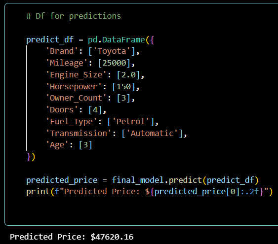

# 🚗 Car Price Prediction

## 🔎 Overview
This project builds a machine learning model to predict car prices based on various features such as engine size, mileage, horsepower, and other specifications.

## 🛠️ Tools
- Python (Pandas, NumPy)
- Scikit-learn
- Matplotlib / Seaborn

## 📝 Key Steps
- Data cleaning & EDA
- Feature preprocessing (scaling & encoding)
- Model development and comparison
- Model evaluation and diagnostics

## 📊 Key Results
- Best Model: **Linear Regression**
- MAE: ~1,500  
- RMSE: ~1,700  
- R²: ~0.96  
The model demonstrates strong predictive performance with relatively low error across the dataset.

## 🔍 Highlights
- Clean dataset with minimal missing values and outliers
- Strong linear relationships between key numerical features and price
- Linear Regression outperformed more complex models
- Residual analysis confirms stable and well-behaved model performance

## ▶️ Example Prediction

## 🔗 Full Project
More detailed explanation available on Notion:  
[Car Price Prediction](https://zesty-fern-8c2.notion.site/Car-Price-Prediction-34a4607c638e8021a602d003354cdaa6?source=copy_link)